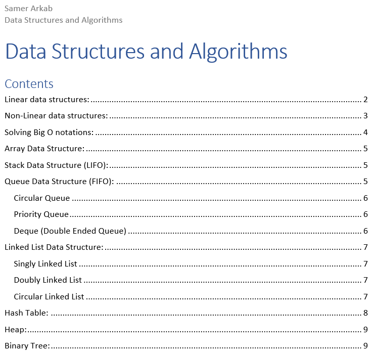
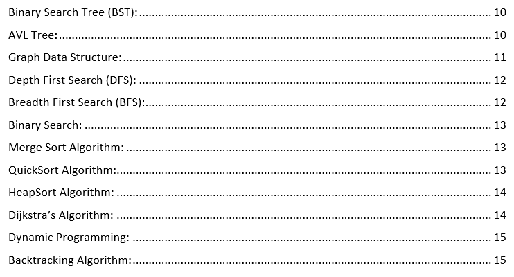

# Implementing-Data-Structures-Algorithms

#### General Info
Working on a simple (but organized neatly in a .doc file) refresher of data structures and algorithms I'm familiar with (including implementations in both JAVA and Python).

#### .doc File Table of Contents:

